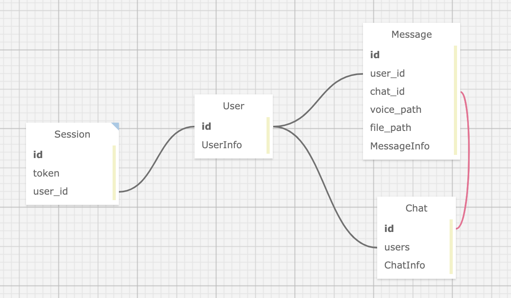
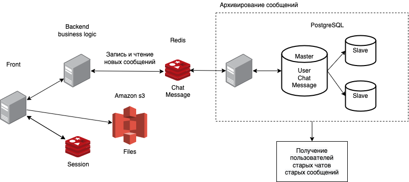
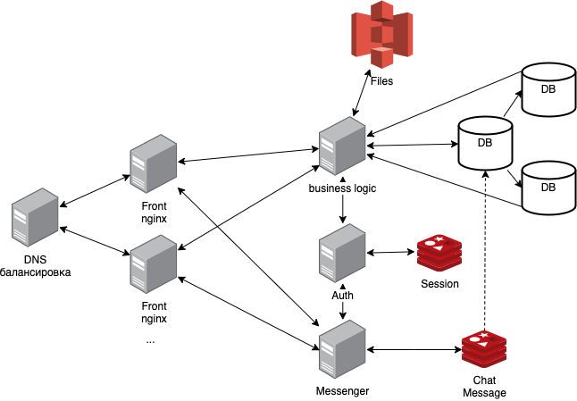

# HighLoad-WhatsApp
Технопарк Mail.ru 3 семестр. Домашнее задание №1 по курсу "HighLoad".

## 1. Тема и целевая аудитория

**WhatsApp** - Cервис обмена мгновенными сообщениями.

### MVP
 - регистрация
 - чат (текстовые сообщения, голосовые сообщения, отправка файлов)
 - групповой чат

### Целевая аудитория

WhatsApp имеет более 2 миллиардов активных пользователей в месяц по всему миру. [[1]](https://www.statista.com/topics/2018/whatsapp/#dossierKeyfigures)

| **Страна**              | **Количество пользователей в месяц, млн** |
| ----------------------- | ----------------------------------------- |
| Индия                   | 390,1                                     |
| Бразилия                | 108,                                      |
| Соединенные Штаты       | 75,1                                      |
| Индонезия               | 68,8                                      |
| Россия                  | 64,7                                      |
| Мексика                 | 62,3                                      |
| Германия                | 48,3                                      |
| Италия                  | 35,5                                      |
| Испания                 | 33,0                                      |
| Соединенное Королевство | 30,1                                      |

## 2. Расчет нагрузки

Ежедневно через WhatsApp отправляется более 100 миллиардов сообщений. [[2]](https://www.affde.com/ru/whatsapp-users.html)

### Продуктовые метрики

* **Месячная аудитория** - 2 млрд.

* **Дневная аудитория** - 1,5 млрд. [[3]](https://vc.ru/social/25453-whatsapp-1b-daily) (с пересчетом на настоящее время)

* **Средний размер хранилища пользователя**
  
  * ***Профиль*** 
  
    Средний размер профиля пользователя составляет 2 Мб (аватарка и методанные о пользователе)
  
  * ***Сообщения*** 
  
    WhatsApp не хранит на серверах **доставленные** сообщения и файлы пользователей. Это значит, что когда пользователь получил новое сообщение (текстовое, голосовое, файл), оно удаляется с сервера (аналогично для групповых чатов, пока все участники не получат сообщение, оно будет храниться на сервере). Непрочитанные сообщения удаляются через 30 дней. [[4]](https://faq.whatsapp.com/general/security-and-privacy/information-for-law-enforcement-authorities/?lang=ru#:~:text=%D0%92%C2%A0%D0%BE%D0%B1%D1%8B%D1%87%D0%BD%D0%BE%D0%BC%20%D1%85%D0%BE%D0%B4%D0%B5,%D0%B2%D0%BA%D0%BB%D1%8E%D1%87%D0%B5%D0%BD%D0%BE%20%D0%BF%D0%BE%C2%A0%D1%83%D0%BC%D0%BE%D0%BB%D1%87%D0%B0%D0%BD%D0%B8%D1%8E) А значит необходимо хранить все сообщения отправленные пользователем за месяц.
  
    В среднем пользователь отправляет:
    100 млрд (всего сообщений в день) / 1.5 млрд (пользователей в день) = 66 сообщений в день.
  
    | **Тип сообщения** | **Количество в день** | **Средний вес в Кб**  |
    |-------------------|-----------------------|-----------------------|
    | текстовое         | 60                    | 0.1                   |
    | голосовое         | 3                     | 500                   |
    | файл              | 3                     | 2000                  |
  
    Из таблицы получаем, что средний вес одного сообщения (любого типа) - 114 Кбайт.
    Сообщения на сервере необходимо хранить в течении 30 дней.
  
    Расчитаем размер хранилища сообщений разных типов для пользователя:
  
    | **Тип сообщения** | **Расчет**                     | **Необходимое место в Кб** |
    | ----------------- | ------------------------------ | -------------------------- |
    | текстовое         | 60 кол-во * 0.1 Кб * 30 дней = | 180                        |
    | голосовое         | 3 кол-во * 500 Кб * 30 дней =  | 45000                      |
    | файл              | 3 кол-во * 2000 Кб * 30 дней = | 180000                     |
    | **Итого**         | -                              | 225180                     |
  
  * ***Итого***
  
    Средний размер хранилища для одного пользователя состовляет:
  
    2 Мб (Профиль) + 220 Мб (Сообщения) = 222Мб
  
* **Среднее количество действий пользователя по типам в день**

  | **Действие**        | **Среднее количество в день** |
  | ------------------- | ----------------------------- |
  | Отправка сообщения  | 66                            |
  | Получение сообщений | 180                           |

  | **Действие**                | **Среднее количество в месяц** |
  | --------------------------- | :----------------------------- |
  | Создание группового чата    | 1                              |
  | Добавление в группововй чат | 3                              |
  
  

### Технические метрики

* **Размер хранения**
  
  На одного пользователя 222 Мбайт, тогда на 2 млрд пользователей:
  
  222 Мбайт * 2 млрд = 423 431 Тб
  
  Расчитаем размер хранилищ по типам данных:
  
  | **Тип данных** | **Расчет**                 | Необходимое место в Тб |
  | -------------- | -------------------------- | ---------------------- |
  | текстовый      | (180 Кб + 2 Мб) * 2 млрд = | 4150                   |
  | аудио          | 45000 Кб * 2 млрд =        | 83820                  |
  | Файл           | 180000 Кб * 2 млрд =       | 335300                 |
  
* **Сетевой трафик**
  
  Основную нагрузку представляют сообщения рассмотрим трафик сообщений по типам:

  | **Тип сообщения** | **Отправка (исходя из дневной аудитории 1.5 млрд)** | **Отправка Тб/сутки** | **Получение (больше из-за груповых чатов)** | **Получение Тб/сутки** |
  |-------------------|-----------------------|---------------------------------------------|------------------------|-----------------------|
  | текстовое         | 60 кол-во * 0.1 Кб * 1.5 млрд =                 | 8.3                   | 164 кол-во * 0.1 Кб * 1.5 млрд =            | 22                     |
  | голосовое         | 3 кол-во * 500 Кб * 1.5 млрд =                  | 2085                  | 8 кол-во * 500 Кб * 1.5 млрд =              | 5560                   |
  | файл              | 3 кол-во * 2000 Кб * 1.5 млрд =                 | 8340                  | 8 кол-во * 2000 Кб * 1.5 млрд =             | 22240                  |
  | **Итого**         | -                                               | 10433                 | -                                           | 27822                  |

    ***Итого***: 10433 + 27822 = 38 255 Тб/сутки

* **RPS в разбивке по типам запросов**
  
  Отправка сообщения: 100млрд / 86400 секунд = 1158000 RPS
  Получение сообщения: Пусть один пользователь 10 раз в день запрашивает новые сообщеня, тогда 10 * 1.5 млрд / 86400 секунд = 173611 RPS
  Создание группового чата: в месяц 2 млрд. 2 млрд / (30 дней * 86400 секунд) = 771 RPS
  Добавление в группововй чат: в месяц 2 млрд * 3 = 6 млрд. 6 млрд / (30 дней * 86400 секунд) = 2313 RPS

  | Действие                    | RPS     |
  | --------------------------- | ------- |
  | Отправка сообщения          | 1158000 |
  | Получение сообщений         | 173611  |
  | Создание группового чата    | 771     |
  | Добавление в группововй чат | 2313    |

## 3. Логическая схема

## 4. Физическая схема

Для хранения информации о сессиях пользователей будем использовать базу данных Redis потому, что она осуществляет хранение данных in-memory, имеет поддержку неблокирующей репликации master-slave и возможность организации кластера Redis cluster.

Для хранения основных данных (чатов, сообщений и пользователей) будем использовать базу данных PostgreSQL, так как она является одной из наиболее функциональных, производительных и широко распространённых реляционных БД. Для увеличения отказоустойчивости будем использовать паттерн master - slave.

Ежедневно отправляется 100 млрд сообщений, чтобы обеспечить их быструю доставку и гарантированное сохранение в базу данных, будем временно сохранять сообщения в in-memory хранилище Redis, и уже потом асинхронно переносить их в реляционную БД, в нашем случае PostgreSQL.

Для хранения файлов будем использовать amazom S3 хранилище, а в базе будем хранить лишь ссылку, которую и будем отдавать клиенту.

При такой большой нагрузке базу данных необходимо шардировать. Хэш по полю id у таблицы Chat, будет определять в какой физической бд находится нужная строчка. Таким образом, можно разбить таблицы Chat и Message по физически разным базам данных.

## 5. Технологии

| Технология | Область применения                        | Мотивационная часть                                          |
| ---------- | ----------------------------------------- | ------------------------------------------------------------ |
| TypeScript | Основной язык для Frontend                | Улучшенный js                                                |
| React      | Библиотека Frontend                       | Используем готовую библиотеку для более быстрого написания приложения |
| nginx      | Web-server Reverse proxy             | Быстрый веб-сервер, простая настройка                        |
| golang     | Основной язык для Backend                 | Быстро писать Backend, дает достаточно хорошую производительность на больших нагрузках |
| c          | Узкие места Backend                       | Обеспечить максимальную скорость в самых нагруженных частях проекта |
| Redis      | Сессии                                    | In-memory БД позволяет обеспечить высокую скорость на чтение и запись |
| MongoDB    | Хранение пользователей и списка его чатов | Отлично подходит для  большого объема данных, поддерживает репликацю. Хорошо использовать, когда в схеме БД мало связей. |
| Amazon S3  | Файловое хранилище                        | Высокая надежность, доступность, производительностью и безопасность |
| Kafka      | Хранение сообщений                        | Распределенная система горизонтально масштабируемая, отказоустойчивая |

## 6. Схема проекта

В качестве балансировщика на первом этапе выстпупает DNS балансировка, далее балансируем с помощью L7-балансировки, которую предоставляет nginx.

nginx выступает как веб сервер, отдающий статику, и реверс прокси сервер.

business logic - основной сервис на бэкенде. Отвечает за создание новых чатыов, возвращает списки чатов.

Auth - сервис отвечающий за авторизацию всех пользователей. Взаимодействует с сессионным хранилищем.

Messenger - сервис отвечающий за отправку новых сообщений. Выделен в отдельный сервис, чтобы обеспечить обслуживание огромнного потока сообщений. Сообщения сохраняются в очередь. После того как получатель, или все получатили (в случает групповых чатов), загрузили себе сообщение из очереди, сообщение удаляется из очереди и больше на серверах не хранится (бизнес требование).

## 7. Список серверов

Для распределения нагрузки предлагается создать 4 датацентра:

- Индия (Мумбаи)
- Бразилия (Сан Пауло)
- Северная Америка (Нью-Йорк)
- Европа (Франкфурт)

Это позволит покрыть основные регионы проживания потенциальных пользователей.

### Сервера для одного ДЦ

При расчете сетевого трафика было получено 38 255 Тб/сутки. Сетевой трафик равномерно распределен в течении суток, а значит можем расчитать нагрузку в секундах: 38255 / 86400 = 0,45 Тб/с

При использовании 40гбит-ных сетевых карт потребуется не меньше

450 / 40 = 12 серверов чтобы выдержавть трафик.

### Сервисы

Для сервисов будут использованы стандартные 32-х ядерные сервера, в таблице приведено примерное количество

| Сервис         | Количество серверов |
| -------------- | ------------------- |
| Front (nginx)  | 12                  |
| Auth           | 10                  |
| Messenger      | 30                  |
| Business logic | 20                  |

### Amazon S3

Необходимо хранить файлы и аудио файлы, их размер состовляет

83820 Тб + 335300 Тб = 420000 Тб

В одном бакете хранится 5 Тб данных, значит потребуется 84к бакетов

## Ссылки на источники
1. https://www.statista.com/topics/2018/whatsapp/#dossierKeyfigures
2. https://www.affde.com/ru/whatsapp-users.html
3. https://vc.ru/social/25453-whatsapp-1b-daily
4. [https://faq.whatsapp.com/general/security-and-privacy](https://faq.whatsapp.com/general/security-and-privacy/information-for-law-enforcement-authorities/?lang=ru#:~:text=%D0%92%C2%A0%D0%BE%D0%B1%D1%8B%D1%87%D0%BD%D0%BE%D0%BC%20%D1%85%D0%BE%D0%B4%D0%B5,%D0%B2%D0%BA%D0%BB%D1%8E%D1%87%D0%B5%D0%BD%D0%BE%20%D0%BF%D0%BE%C2%A0%D1%83%D0%BC%D0%BE%D0%BB%D1%87%D0%B0%D0%BD%D0%B8%D1%8E.)
